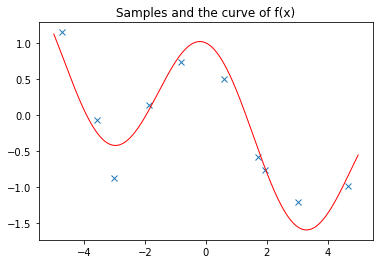
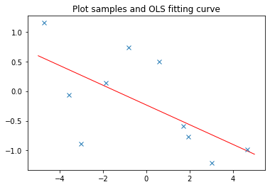
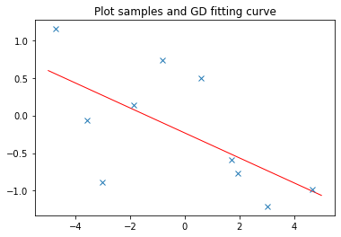
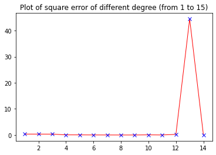
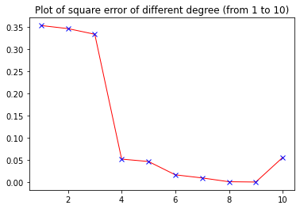
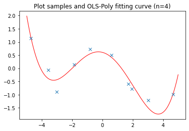
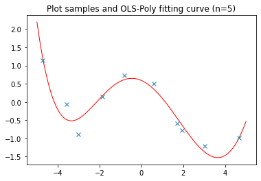
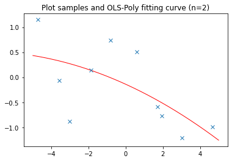
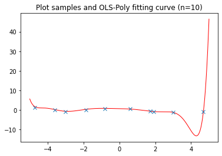

## 《机器学习》第三次课后作业

姓名：李伟		学号：2120210454		专业：计算机科学与技术

###  一、问题描述：

#### 1.1 证明题

线性回归最小二乘法获得最优参数值得必要条件证明：预测误差为零均值且与输入无关。试说明”零均值”和”无关”的依据是什么？

> 对于线性回归问题，最小二乘法通过构建最小二乘估计量估计最优参数值，要想实现最优化参数估计，则要求最小二乘估计量为总体的无偏估计量，同时要求估计量的方差是最小的，因而就要要求，预测误差为零均值并与输入无关。具体证明见后文。

#### 1.2 线性回归问题（编程题）

数据集由10个样本($x_i$,$y_i$)组成，其中$y_i = - \sin(x_i/5)+\cos(x_i)+\epsilon$ ，$x_i \sim \mathcal{U}[-5,5]$，其中$\epsilon \sim \mathcal{N}(0, 0.2^2)$。

(1) 绘制样本散布图和$y_i = f(x_i)$的曲线；

> 通过随机数生成10个样本点$(x_i, y_i)$，绘制样本散点图并绘制 $y_i = f(x_i)$的曲线。

(2) 编程实现解决线性回归问题的最小二乘法和梯度下降方法；

> 通过变成实现最小二乘参数估计以及通过梯度下降法实现对线性回归参数的逼近。

(3) 使用(2)中实现的两种方法求解数据集的线性回归方程，并给出数据集的均方误差；

> 利用训练好的模型得到样本点的预测值，并与真实值比较计算数据集的均方差。

(4) 解释(3)中你所得到的结果，并对两种求解方法进行比较；

> 从(3)的结果出发，分析两种求解方法的性能比较情况。

(5) 使用(2)中实现的最小二乘法解决数据集多项式回归问题的最佳解。

> 通过多项式非线性函数，将输入x计算为多项式输入，通过(2)中实现的最小二乘法进行估计，得到多项式回归结果。

###  二、基本思路：

#### 2.1 证明题

如1.1所述，由于最小二乘估计量的无偏性和最小方差性证明，要求预测误差应该是零均值并与输入无关，据此可以说明”零均值”和”无关”的理论依据。

#### 2.2 线性回归问题（编程题）

**最小二乘法：**

最小二乘法是一种数学优化技术，他通过最小化。误差的平方和来寻找数据的最佳函数匹配。利用最小二乘方法可以简便地求得未知的数据，并使得这些写求得的数据与实际数据之间的误差的平方和为最小。

最小二乘法的基本思路是：设$(x,y)$是一对观测量，且$x=[x_1, x_2, ..., x_n]^T\in R^n, y=R$ 满足以下的理论函数：$y=f(x,\omega)$，其中$\omega=[{\omega}_1,{\omega}_2,{\omega}_3,...,{\omega}_n]^T$为待定参数。

为了寻找函数$f(x,\omega)$的参数$\omega$的最优估计值，对于给定$m$组（通常$m>n$）观测数据$(x_i,y_i)(i=1,2,...,m)$，求解目标函数：
$$
L(y,f(x,\omega))=\sum_{i=1}^{m}[y_i-f(x_i,{\omega}_i)]^2
$$
取最小值的参数${\omega}_i(i=1,2,...,n)$。

**梯度下降法：**

梯度下降法是一个一阶最优化算法，通常也称为最陡下降法，要使用梯度下降法找到一个函数的局部最小值，必须向函数上该点对应的梯度反方向的规定长度距离点进行迭代搜索。

如果实值函数$F(x)$在点$a$处可微且有定义，那么函数$F(X)$在点$a$处沿着梯度的相反方向，下降最多，如果
$$
b = a - \lambda\nabla F(a)
$$
对于$\lambda>0$为一个足够晓的数值时成立，那么$F(a)\geq F(b)$。从局部极小值的初始估计点$x_0$出发，并考虑基于梯度下降方向选择如下的序列$x_0,x_1,...$ 使得
$$
x_{n+1} = x_n - {\lambda}_n\nabla F(x_n), n\geq 0.
$$
因此得到的函数值序列存在
$$
F(x_0)\geq F(x_1) \geq F(x_2) \geq ...,
$$
最终会逐渐向局部极小值收敛。

### 三、解题步骤：

#### 3.1 证明题

由于最小二乘法通过最小二乘估计量的计算来估计最优参数值，为了更好地拟合真实分布，要求最小二乘估计量应该是无偏的，即估计量的期望值应该等于总体的真实值。

假设样本回归函数为
$$
\hat{Y} = \hat{{\beta}_0}+\hat{{\beta}_1}X
$$
则参数估计表示为
$$
\left\{ 
	\begin{array}{**lr**}
	\hat{{\beta}_0} = \overline{Y}-\hat{{\beta}_1}\overline{X} \\
	\hat{{\beta}_1} = \frac{\sum{x_iy_i}}{\sum{{x_i}^2}}=\sum{\frac{x_iY_i}{\sum{{x_i}^2}}} 
	\end{array}
\right.
$$
同时预测误差为$e_i = Y_i - (\hat{\beta}_0+\hat{\beta}_1X_i)$；令$k_i=\frac{x_i}{\sum{{x_i}^2}}$，$w_i = \frac{1}{n}-\overline{X}k_i$，则有
$$
\left\{ 
	\begin{array}{**lr**}
	\hat{{\beta}_0} = \sum k_iY_i \\
	\hat{{\beta}_1} = \sum w_iY_i
	\end{array}
\right.
$$
即估计变量具有线性性，假设随机随机扰动误差为$\mu _i$,则真实值可以表示为$Y_i = \beta _0 + \beta _1 X_i + \mu _i$,估计量的无偏性有
$$
E(\hat{\beta _1}|X) =&E(\sum k_i Y_i)\\=& E(0+\beta _1 +\sum k_i\mu _i) \\= & \beta _1 + \sum(k_i E(\mu _i|X)) = \beta _1\\
E(\hat{\beta _0}|X) = & \beta _0 + \sum(w_i E(\mu _i|X)) = \beta _0
$$
则要求$E(\mu _i|X) = 0$，即预测误差应该是零均值的且与输入无关。

#### 3.2 线性回归问题（编程题）

- 样本数据生成

通过构建函数$f(x)$，并从[-5, 5]区间内随机采样10个$x_i$值作为样本自变量，通过$f(x)+\epsilon$计算得到样本值，随机扰动项的计算通过从正态分布$\mathcal{N}(0, 0.2^2)$中随机采样得到。具体实现代码如下：

```python
# from utls.py
def f(x):
    '''
        The function f(x)
        @param: x, the x-axis
        @return: the value of f(x)
    '''
    return -np.sin(x/5)+np.cos(x)

def Generate_Samples(N,X_range,mu,sigma,func):
    '''
        Generate the samples with the function f(x) and error epsilons
        @param: N the, samples numbers 
                X_range, the value range of x_i
                mu, the mean of the error normal distribution
                sigma, the standard deviation of the error normal distribution
        @return: samples, the generated samples. 
    '''
    # Ensure consistent generation of random numbers to facilitate debugging and display results, you can comment out
    np.random.seed(1)  
    # Generate samples
    epsilons = np.random.normal(mu,sigma,N)
    X = np.random.uniform(X_range[0],X_range[1],N)
    samples = []
    for x_i, epsilon in zip(X,epsilons):
        samples.append((x_i,func(x_i)+epsilon))
    return samples,epsilons
```

- 最小二乘法实现

利用输入样本计算正规化方程，基于矩阵运算计算得到样本参数估计以及常数偏置项，具体实现代码如下：

```python
# from OLS.py
class OLS(object):
    '''
    Fit the input data samples with the OLS method.
    @param: input_dim, the input dimension
            output_dim, the output dimension
            x , the input data
            y , the output data
    '''

    def __init__(self,input_dim,output_dim) -> None:
        self._input_dim = input_dim
        self._output_dim = output_dim 
        self._weight = np.mat(np.zeros((self._input_dim,self._output_dim)))
        self._bias = np.mat(np.zeros((1,self._output_dim)))

    def predict(self,x):
        return (np.array(x)).dot(self._weight)+self._bias

    def square_error(self,x,y):
        x = np.array(x)
        y = np.array(y)
        y_pred = self.predict(x)
        return square_error(y_pred,y)

    def fit(self,x,y,show_parameters=True):
        x = np.array(x)
        y = np.array(y)
        x = np.hstack((x,np.ones((x.shape[0],1))))  # add the bias
        omiga = np.linalg.inv(x.T.dot(x)).dot(x.T).dot(y)  # solve the equation
        self._weight = omiga[:-1,:]
        self._bias =omiga[-1:,:]
        if show_parameters:
            print("[OLS] weight matrix:\n",self._weight)
            print("[OLS] bias vector:\n",self._bias)
```

- 梯度下降法实现

首先构建评估估计值与真实值误差的平均平方差计算函数，实现代码如下所示：

```python 
# from utls.py
def square_error(y_pred,y_true):
    '''
        Calculate the square loss
        @param: y_pred, the predicted value
                y_true, the true value
        @return: the square error
    '''
    input_size_1 = y_pred.shape[0]
    input_size_2 = y_true.shape[0]
    
    if input_size_1 != input_size_2:
        raise ValueError("The size of y_pred and y_true must be the same!")
    if y_pred.shape[1] != y_true.shape[1]:
        raise ValueError("The size of y_pred and y_true must be the same!")
    y_pred = np.array(y_pred)
    y_true = np.array(y_true)
    return np.sum(np.sum(((y_true - y_pred) ** 2), axis=1) / y_pred.shape[1]) / y_pred.shape[0]
```

然后通过设定回归预测参数初始值，利用均方差误差计算损失，通过梯度下降方法迭代修正回归参数，降低均方差误差，当当迭代过程中误差下降低于一定的阈值（如0.000001)即表明回归收敛，停止迭代，得到对于样本的线性回归拟合结果。具体实现代码如下所示：

```python 
# from GD.py
class GD(object):
    '''
    Fit the input data samples with the GD method.
    @param: input_dim, the input dimension
            output_dim, the output dimension
            x , the input data
            y , the output data
    '''

    def __init__(self,input_dim,output_dim) -> None:
        self._input_dim = input_dim
        self._output_dim = output_dim 
        self._weight = np.mat(np.zeros((self._input_dim,self._output_dim)))
        self._bias = np.mat(np.zeros((1,self._output_dim)))
    
    def predict(self,x):
        return np.array(x).dot(self._weight)+self._bias
    
    def square_error(self,x,y):
        x = np.array(x)
        y = np.array(y)
        y_pred = self.predict(x)
        return square_error(y_pred,y)

    def fit(self,x,y,learning_rate=0.01,epochs=1000,show_parameters=True):
        x = np.mat(x)
        y = np.mat(y)
        total_loss = []
        x_N,_ = x.shape
        for epoch in range(epochs):
            pred_y = self.predict(x).reshape(-1,1)
            loss = square_error(pred_y,y)
            dW = np.mat(np.zeros((self._input_dim,self._output_dim)))
            db = np.mat(np.zeros((1,self._output_dim)))
            for i in range(x_N):
                dW += x[i,:]*(pred_y[i]-y[i])
                db += pred_y[i,:]-y[i,:]
            # update the weight and bias
            self._weight = self._weight - learning_rate*dW
            self._bias = self._bias - learning_rate*db
            
            if epoch%10 == 0:
                print("[GD] epoch: ",epoch," loss: ",loss)
                if len(total_loss)>=1 and total_loss[-1] - loss < 0.000001:
                    print("[GD] converge at epoch: ",epoch)
                    break 
            total_loss.append(loss)
            
        print("[GD] stop training.")
        if show_parameters:
            print("[GD] weight matrix:\n ",self._weight)
            print("[GD] bias vector:\n ",self._bias)
```

- 数据集均方差计算

线性回归拟合函数预测结果与真实值之间的均方差计算函数实现如上所述，不再再次说明。

- 多项式回归问题求解

多项式回归问题，可以先映入非线性多项式函数将输入进行非线性拓展，然后将拓展后的数据利用最小二乘法进行线性拟合，从而得到多项式回归问题的拟合结果，但是由于不确定具体拟合的多项次次数，因此可以从1次到15次进行分别尝试，选取拟合最好的结果作为最终结果。非线性拓展函数如下所示：

```python 
# from utls.py
def poly(x, n):
    '''
        Calculate the polynomial
        @param: x, the x-axis
                n, the degree of the polynomial
        @return: the value of the polynomial
    '''
    x_poly = np.ones(x.shape[0]).reshape(-1,1)
    for i in range (1,n+1):
        x_poly = np.hstack((x_poly, x**(i)))
    return x_poly[:,1:]
```

设定不同的次数利用最小二乘法进行多项式回归拟合，具体代码如下所示：

```python 
# from linear_regression.ipynb
from OLS import OLS
from utls import poly
error_of_different_degree = []
for i in range(1,9):
    n = i  # the degree of polynomial
    x_data_poly = poly(x_data,n)  # generate the polynomial data
    ols_poly = OLS(n,1)
    ols_poly.fit(x_data_poly,y_data,show_parameters=False)
    performance = ols_poly.square_error(x_data_poly,y_data)
    print("[OLS] square error for poly degree (%d): %.8f"%(i,performance))
    error_of_different_degree.append([i,performance])
```

### 四、结果与分析

**注意：代码文件中utls.py文件为相关辅助函数实现，OLS.py为最小二乘法实现代码，GD.py为梯度下降法实现代码，主要函数和线性回归拟合的主函数代码以及相关结果在linear_regression.ipynb文件中，通过运行该文件代码即可获取所有生成结果。**

- 样本数据生成

为了使每次随机结果和样本保持一致，设定固定的随机种子，生成的随机样本如下所示：

```
(1)	[x,y,epsilon] = [-4.73, 1.15, 0.32]
(2)	[x,y,epsilon] = [-3.60, -0.07, -0.12]
(3)	[x,y,epsilon] = [-3.02, -0.89, -0.11]
(4)	[x,y,epsilon] = [-1.87, 0.14, -0.21]
(5)	[x,y,epsilon] = [-0.83, 0.74, 0.17]
(6)	[x,y,epsilon] = [0.59, 0.50, -0.46]
(7)	[x,y,epsilon] = [1.70, -0.59, 0.35]
(8)	[x,y,epsilon] = [1.92, -0.77, -0.15]
(9)	[x,y,epsilon] = [3.01, -1.21, 0.06]
(10)[x,y,epsilon] = [4.68, -0.99, -0.05]
```

绘制样本散布图与函数曲线如下所示：



- 最小二乘法实现

最小二乘法实现的预测函数为 $y_i  = -0.16576646x_i-0.23364877$，绘制拟合曲线如下所示：



- 梯度下降法实现

梯度下降法实现的线性回归预测函数为$y_i = -0.16573469x_i-0.2325068$，绘制拟合曲线如下所示：



- 数据集均方差计算

最小二乘法预测结果的均方差为**0.3539150289218257**；

梯度下降法预测结果的均方差为**0.35391632630884895**。

**从最小二乘法和梯度下降法线性回归拟合函数和绘制的曲线来看，二者拟合的效果接近，差别不大，但是从与数据集样本比较计算的均方差来看，梯度下降法预测结果的均方差要略高于最小二乘法拟合结果的均方差，说明最小二乘法线性回归拟合效果要略优于梯度下降方法拟合的线性回归函数。**

- 多项式回归问题求解

从多项次次数为1到15分别尝试多项式回归拟合样本，并计算相应的均方差，绘制图形如下：



可以看到当次数小于10次的时候，均方差呈现下降趋势，之后开始出现异常的极值，因此进一步我们将次数范围限制在[1, 10]，重新绘制均方差随次数变化图形如下：



可以看到均方差在次数为4时出现了最大下降率，因此我们说明拟合结果相对较好，我们选取次数为4和5拟合结果，并绘制拟合曲线如下：





可以看到拟合曲线的效果与$f(x)$比较接近，为了突出次数不同的差异性，进一步分别选取次数为2和10进行多项式回归拟合，并绘制图形拟合曲线如下所示：





从上面的两个拟合曲线来看，当次数为2次的时候，拟合效果不好，因为二次曲线并没有很好的能够拟合样本数据，而当次数为10次的时候，所有的样本点均在拟合曲线上，但是由于样本点较少，该拟合曲线将样本点自身的随机特征也考虑进来，虽然完全拟合了样本数据，但是存在过拟合，对于真实样本分布的拟合效果并不好。

因此我们选取次数为4作为多项式回归预测最佳解，其拟合函数如下所示:

$y_i = 0.01153878x_i ^4-0.00288701x_i ^3-0.27776141x_i ^2-0.15037102x_i+0.60467641$

### 参考材料

[1] 雷明. 机器学习与应用[M]. 清华大学出版社, 2019. 

[2] *Machine Learning*. Tom M. Mitchell. ISBN: 0071154671, 9780071154673. Publisher: McGraw-Hill, 1997