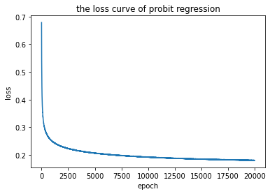
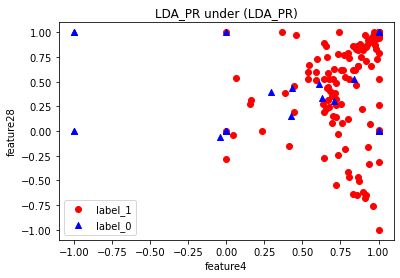
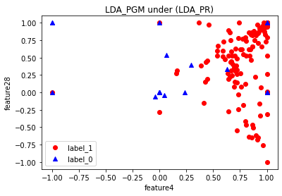
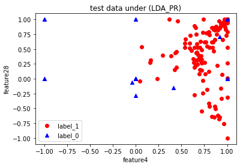

# 《机器学习》第四次课后作业

姓名：李伟	学号：2120210454	专业：计算机科学与技术

## 一、问题描述 

给定数据集`lonosphere Dataset. csv`，完成两类分类问题，数据集中包含351个样本，其中前200个样本作为训练样本集，后151个样本作为测试样本集。每一个样本由34个特征描述组成，两个类别分别使用`g`和`b`进行标记。

需要解决的主要问题包括一下几个：

1. 分别编程实现线性判别式最小二乘算法、`Probit`回归算法，概率生成算法（假设类条件概率密度分布为正态分布），并使用训练数据集对算法进行训练；
2. 计算不同模型在训练样本集和测试样本集上的错误率；
3. 比较`Probit`回归算法和概率生成模型的结果，并分析两种结果的原因。

## 二、基本思路

### 2.1 线性判别式最小二乘算法

线性判别式实现分类任务，旨在找到不同类别节点在特征空间中的决策边界。对于两类分类问题，给定数据集$\{x_i, t_i\}, i = 1,2,...,N$， 矩阵$T$的第$i$行是矢量$t_i^T$，矩阵$\widetilde{x}$的第$i$行是$x_i^T$。则平方误差函数为
$$
\textbf{E}({\widetilde{W}}) = \frac{1}{2} \textbf{Tr}\{(\widetilde{X}\widetilde{W}-T)^T(\widetilde{X}\widetilde{W}-T)\}
$$
令误差函数对$\widetilde{W}$的倒数为零，取得最小误差，则可以活动的解
$$
\widetilde{W} = (\widetilde{X}^T\widetilde{X})^{-1}\widetilde{X}^T\widetilde{T} = \widetilde{X}^{\dagger}T
$$

其中$\widetilde{X}^{\dagger}$是$\widetilde{X}$的伪逆矩阵；则可以得到判别式函数为：
$$
y(x) = \widetilde{W}^T\widetilde{x} = \widetilde{T}^T(\widetilde{X}^\dagger)^T\widetilde{x}
$$

### 2.2 `Probit`回归模型

`Probit`回归模型和逻辑回归模型类似，其目的是为了最大化后验概率$p(c|x)$，不同的是`Probit`回归模型使用`Probit`函数作为回归模型的非线性激活函数。`Probit`函数可以表示为如下所示形式：
$$
\Phi(\alpha)=\int_{-\infty}^{\alpha} \mathcal{N}(\theta|0,1)d\theta
$$
对于二分类问题，使用交叉熵误差函数进行误差计算，对于`Probit`回归模型的拟合，可以使用梯度下降法进行训练，迭代优化参数，实现回归预测分类。误差函数对于矢量$\omega$的梯度计算方式为：
$$
\grad\textbf{E}(\omega) = \sum_{i=1}^{N} (y_i - t_i) \phi _i = \sum_{i=1}^N (\sigma(\omega ^T \phi _i)-t_i) \phi _i
$$
其中$d \sigma / d\alpha = \sigma(1-\sigma)$，$y_i = \sigma(\alpha_i)$且$\alpha_i = \omega^T \phi_i$ ，$\phi_i$ 表示样本$i$的特征输入。

### 2.3 概率生成模型

概率生成方法旨在建模条件密度$p(x|c_k)$和类后验概率$p(c_k)$，然后利用Bayes定理计算后验概率$p(c_k|x)$。对于两类问题，使用挤压函数`logistic sigmoid`函数。则假设类条件密度分布服从正态分布，且所有类别具有相同的协方差矩阵，则对于样本$x\in c_k$的密度函数为：
$$
p(  x|c_ {k}  )= \frac {1}{(2\pi )^ {D/2}} \frac {1}{|\Sigma|}  \exp\{{-  \frac {1}{2}  (x-\mu _ {k})^ {T}  \Sigma ^ {-1}  (x-  \mu _ {k}  )}\}
$$
则后验概率表示为：
$$
p(c_1|x) = \sigma ( \omega^ {T}x  + \omega_ {0}  )
$$
其中：
$$
\omega = \Sigma ^{-1} (\mu_1-\mu_2) \\
\omega_{0}= - \frac{1}{2}\mu_1^T\Sigma^{-1}\mu_1 + \frac{1}{2}\mu_2^T\Sigma^{-1}\mu_2+\ln \frac{p(c_1)}{p(c_2)}
$$
则通过计算训练集数据的均值和协方差即可计算得到模型参数$(\omega, \omega_0)$.

## 三、解题步骤

对于输入数据集，首先进行数据的载入和训练集以及测试集的数据划分，根据要求，采用前200个样本作为训练集，后151个样本作为测试集，本文实现了`DataLoader`类(`./dataloader.py`)实现对于数据集的载入和划分工作，**在本文中，我们将类别'g'标记为'1'，类别'b'标记为'0'**，具体代码如下所示：

```python
# from dataloader.py
import pandas
class DataLoader:
    def __init__(self, data_path):
        '''
        :param data_path: the path of the data
        '''
        self.data_path = data_path
        self.data = self._load_data()

    def _load_data(self):
        '''
        :return: the data
        '''
        return pandas.read_csv(self.data_path, header=None,index_col=None)

    def _get_data(self,columns):
        '''
        get the data colums according to the columns index list
        :param columns: the index list of the columns
        :return: the data as a list type
        '''
        return self.data[columns].values.tolist()
    
    def _get_col_count(self):
        '''
        get the column count of the data
        :return: the column count
        '''
        return self.data.shape[1]

    def data_split(self,train_number = 200):
        '''
        split the data into train set and test set
        :param train_number: the number of train set
        :return: the train set and test set
        '''
        features = self._get_data(range(0,self._get_col_count()-1))
        labels = self._get_data(range(self._get_col_count()-1,self._get_col_count()))
        # labels should be translated as one-hot type, the label 'g' as 1, 'b' as 0
        labels = [[1 if i == 'g' else 0 for i in j] for j in labels]
        train_features = features[:train_number]
        train_labels = labels[:train_number]

        test_features = features[train_number:]
        test_labels = labels[train_number:]
        
        train_set = (train_features,train_labels)
        test_set = (test_features,test_labels)
        return train_set,test_set

    def get_row_count(self):
        '''
        get the row count of the data
        :return: the row count
        '''
        return self.data.shape[0]
```

### 3.1 线性判别式最小二乘算法

对于线性判别式最小二乘法，由于是二分类问题，可以只需要关注其中一种类别即可。通过正规化方程可以得到最小二乘解，从而确定参数，具体实现代码如下所示：

```python
#from LDA_OLS.py
import numpy as np

class LDA_OLS:
    def __init__(self,input_dim,output_dim):
        '''
        :param input_dim: the input dimension of the data
        :param output_dim: the output dimension of the data
        :param save_model: whether to save the model
        '''
        self.input_dim = input_dim
        self.output_dim = output_dim
        self._w = np.zeros((self.input_dim,self.output_dim))
        self._b = np.zeros((1,self.output_dim))

    def fit(self,X,y):
        '''
        :param X: the input data
        :param y: the output data, represented as one-hot type
        :return: the model
        '''
        X = np.array(X)
        y = np.array(y)
        X = np.hstack((X,np.ones((X.shape[0],1))))  
        temp_weight = np.dot(np.linalg.pinv(X),y)
        self._w = temp_weight[:-1,:]
        self._b = temp_weight[-1:,:]

    def predict(self,X):
        X = np.array(X)
        prob = np.dot(X,self._w)+self._b
        return prob

    def get_w(self):
        return self._w
    
    def get_b(self):
        return self._b
    
    def save_model(self,save_path):
        np.save(save_path+self.__class__.__name__,{
            'wight':self._w,
            'bias':self._b
        })

    def load_model(self,load_path):
        model = np.load(load_path+self.__class__.__name__+'.npy',allow_pickle=True)
        self._w = model['wight']
        self._b = model['bias']
```

在这里线性判别回归模型判别的是输入样例特征属于类别“1”的概率$p$，如果概率$p$越接近1，则属于类别“1”，属于类别"0"的概率为$1-p$，类中函数$fit(X, y)$用来对模型参数进行估计，函数$predict(X)$用来预测输入$X$的属于类别“1”的概率。

### 3.2 `Probit`回归模型

对于`Probit`回归模型，首先实现`Probit`激活函数如下，即正态分布的累计概率密度函数，在这里本文调用`scipy.stats.norm.cdf()`实现：

```python
# from utls.py
def probit(x):
    '''
    :param x: the input
    :return: the probit function return of the input
    '''
    return st.norm.cdf(x)
```

然后，进一步的，设计预测函数如下所示：

```python
# from LDA_PR.py :class LDA_PR 
	def predict(self,X):
        X = np.array(X)
        prob = np.dot(X,self._w)+self._b  # linear layer
        prob = probit(prob)               # probit activation function
        return prob
```

类似的，通过设计类成员函数`fit(·)`对模型参数进行估计，这里使用梯度下降法，具体实现代码如下所示：

```python
# from LDA_PR.py
	def fit(self,X,y,lr = 0.01,max_epoch= 1000,batch_size = 100,epsilon = 1e-6,show_parameter= False):
        '''
        :param X: the input data
        :param y: the output data, represented as one-hot type
        :return: the model
        '''
        X = np.array(X)
        y = np.array(y)
        x_N, _ = X.shape
        all_loss = []
        for epoch in range(1,max_epoch+1):
            shuffle_index = np.random.permutation(x_N)
            X, y = X[shuffle_index],y[shuffle_index]
            loss = 0.0
            for iter in range(0,x_N,batch_size):
                X_batch = X[iter:iter+batch_size,:]
                y_batch = y[iter:iter+batch_size,:]
                prob = self.predict(X_batch)
                # cross entroy loss for probit regression
                loss += - np.sum(np.sum(y_batch*np.log(prob)+(1-y_batch)*np.log(1-prob),axis=1))
                grad_w = np.dot(X_batch.T,prob-y_batch)
                grad_b = np.sum(prob-y_batch,axis=0)
                self._w -= lr*grad_w
                self._b -= lr*grad_b
            loss = loss/x_N
            
            if show_parameter and epoch%1000 == 0:
                print('epoch:',epoch,'loss:',loss)
                if len(all_loss) >= 1 and abs(all_loss[-1] - loss) < epsilon:
                    break

            all_loss.append(loss)

        if show_parameter:
            print('weight:',self._w)
            print('bias:',self._b)
        return all_loss
```

为了让模型损失下降的更加平滑，提升训练效果，这里使用了小批量梯度下降法进行模型训练，当损失函数下降幅度低于阈值之后停止训练。

### 3.3 概率生成模型

对于概率生成模型，重点在于对于训练集中各特征维度数据均值以及协方差的计算，从而基于此得到模型的参数，对于二分类问题，使用`sigmoid`函数作为挤压函数。具体的核心实现代码如下所示：

```python
# from LDA_PGM.py
	def fit(self,X,y):
        '''
        :param X: the input data
        :param y: the output data, two class and the output_dim is 1, with the value 0 or 1
        :return: the model
        '''
        X = np.array(X)
        y = np.array(y)  
        
        # get the mean of each class
        mean_y1 = np.mean(X[y.flatten()==1],axis=0)
        mean_y2 = np.mean(X[y.flatten()==0],axis=0)
        # print(mean_y1)
        # print(mean_y2)

        # get the covariance matrix of class 1
        cov = np.cov(X.T)
        print(cov.shape)
        # get the prior probability of each class
        prior_y1 = np.sum(y.flatten()==1)/len(y)
        prior_y2 = np.sum(y.flatten()==0)/len(y)

        # get the weight matrix
        inverse_cov_y1 = np.linalg.pinv(cov)
        
        self._w = np.dot(inverse_cov_y1,mean_y1-mean_y2).reshape(-1)
        self._b = -0.5*np.dot(np.dot(mean_y1.T,inverse_cov_y1),mean_y1)+0.5*np.dot(np.dot(mean_y2.T,inverse_cov_y1),mean_y2)+np.log(prior_y1/prior_y2)
       

    def predict(self,X):
        X = np.array(X)
        prob = np.dot(X,self._w)+self._b
        prob = sigmoid(prob)
        return prob
    
```

### 3.4 错误率计算

由于是二分类任务，对于错误率的计算只需要统计与真实类别不同的测试样例个数占总测试样例数量的比例即可，本文将分类准确的概率阈值设置为0.5，即模型预测属于类别“1”的概率超过0.5，即认为该样例属于类别“1”，否则属于类别“0”，从而将模型的概率分类结果转换为类别分类结果。从而统计各个模型的错误率，基于此实现错误率计算函数如下：

```python
def test(model,test_features,test_labels):
    '''
    :param model: the model
    :param test_features: the test features
    :param test_labels: the test labels
    :return: the error of the model
    '''
    np.array(test_features)
    np.array(test_labels)

    # get the predict labels probability 
    predict_labels = model.predict(test_features)  # (n,1)
    predict_labels = np.int64(predict_labels>0.5).flatten() # > 0.5 belongs to class "1"
    # get the error
    error = np.sum(np.array(predict_labels) != np.array(test_labels.flatten()))/len(test_labels.flatten())
    return error
```

## 四、结果与分析

各个模型的实现代码分别位于`LDA_OLS.py`、`LDA_PR.py`、`LDA_PGM.py`文件，`utls.py`文件包含一些必要的辅助函数，`dataloader.py`文件为数据集载入和处理代码，`classification_main.ipynb`文件包含对于各个模型的训练和测试以及结果展示代码。各个模型的测试结果如下所述。

### 4.1 线性判别式最小二乘算法

对于线性判别式最小二乘法来说，其在训练集和测试集上的错误率如下所示：

- 训练集错误率：0.125
- 测试集错误率：0.09271523178807947

### 4.2 `Probit`回归模型

对于 `Probit`回归模型，其在训练集与测试集上的错误率如下所示：

- 训练集错误率：0.085
- 测试集错误率：0.09271523178807947

特别的，对于回归模型的训练而言，本文采用了小批量梯度下降法进行训练，学习率设置为0.001，最大训练批次数量为20000轮，batch_size设置为64，损失下降阈值epsilon设置为1e-6，模型训练损失变化曲线如下所示：



### 4.3 概率生成模型

对于概率生成模型，其在训练集与测试集上的错误率如下所示：

- 训练集错误率：0.125
- 测试集错误率：0.09271523178807947

### 4.4 `Probit`回归模型与概率生成模型比较

从上述的结果，我们能够发现，概率生成模型和线性判别式最小二乘法得到的模型在训练集和测试集上的错误率是一样的，同时值得注意的是本文在上述参数设置下训练得到的`Probit`回归模型在训练集上实现的错误率低于另外两个方法，而在测试集上的错误率与另外两个方法达到了一致的结果。***当然，这个结果是经过多次尝试后得到的（已知）最优训练结果。***

对于上面呈现出来的结果，进一步对训练得到的各模型参数进行分析，粗略选取各个模型中参数中较大的几类特征维度如下所示：

- 最小二乘法：维度[0, 6, 2]
- `Probit`回归模型：维度[0, 4, 28]
- 概率生成模型：维度[0, 6, 2]

也可以从这里发现概率生成模型和最小二乘法模型的到的结果高度相似。

对于维度4，和28，抽取特征展示散点图分类情况，`Probit`回归模型和概率生成模型以及测试数据集真实标签情况如下所示:







从上面图片可以看出，在测试集上，虽然两个模型关注的特征维度各有不同，但是在分类准确情况上来说差别并不大，因此可以证明二者在有限的测试集上确实能够表现相接近的性能。

综上所述，可以得到如下的结论：

- 最小二乘法和概率生成模型能够得到相对接近最优的模型结果，并且二者的性能几乎相同。
- `Probit`回归模型通过合适的参数利用梯度下降法迭代训练，可以在测试集上达到和另外两个模型几乎相同的模型性能，此外，通过合适的迭代训练过程，`Probit`回归模型能够在训练集上达到更低的错误率。本文认为：**这是由于利用梯度下降法在解空间中逐渐逼近最优极值点，能够探索更多的拟合情况，从而实现在训练集中更优的理想分类模型拟合结果。**
